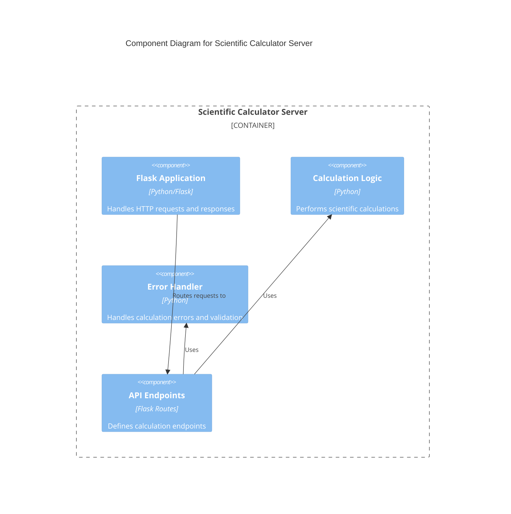

```mermaid
    C4Component
    title Component Diagram for Scientific Calculator Server

    Container_Boundary(scientificServer, "Scientific Calculator Server") {
        Component(flaskApp, "Flask Application", "Python/Flask", "Handles HTTP requests and responses")
        Component(calcLogic, "Calculation Logic", "Python", "Performs scientific calculations")
        Component(errorHandler, "Error Handler", "Python", "Handles calculation errors and validation")
        Component(apiEndpoints, "API Endpoints", "Flask Routes", "Defines calculation endpoints")
    }

    Rel(apiEndpoints, calcLogic, "Uses")
    Rel(apiEndpoints, errorHandler, "Uses")
    Rel(flaskApp, apiEndpoints, "Routes requests to")
```