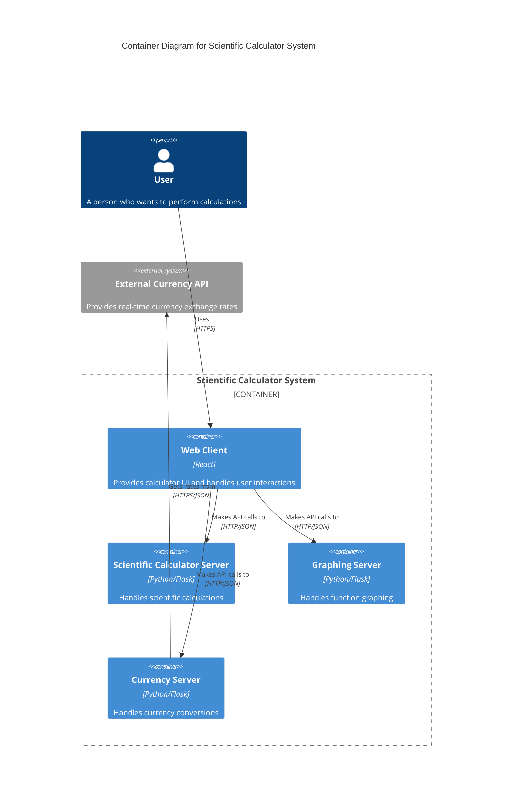

```mermaid
    C4Container
    title Container Diagram for Scientific Calculator System

    Person(user, "User", "A person who wants to perform calculations")

    Container_Boundary(calculatorSystem, "Scientific Calculator System") {
        Container(webClient, "Web Client", "React", "Provides calculator UI and handles user interactions")
        Container(scientificServer, "Scientific Calculator Server", "Python/Flask", "Handles scientific calculations")
        Container(graphingServer, "Graphing Server", "Python/Flask", "Handles function graphing")
        Container(currencyServer, "Currency Server", "Python/Flask", "Handles currency conversions")
    }

    System_Ext(currencyAPI, "External Currency API", "Provides real-time currency exchange rates")

    Rel(user, webClient, "Uses", "HTTPS")
    Rel(webClient, scientificServer, "Makes API calls to", "HTTP/JSON")
    Rel(webClient, graphingServer, "Makes API calls to", "HTTP/JSON")
    Rel(webClient, currencyServer, "Makes API calls to", "HTTP/JSON")
    Rel(currencyServer, currencyAPI, "Gets rates from", "HTTPS/JSON")
```