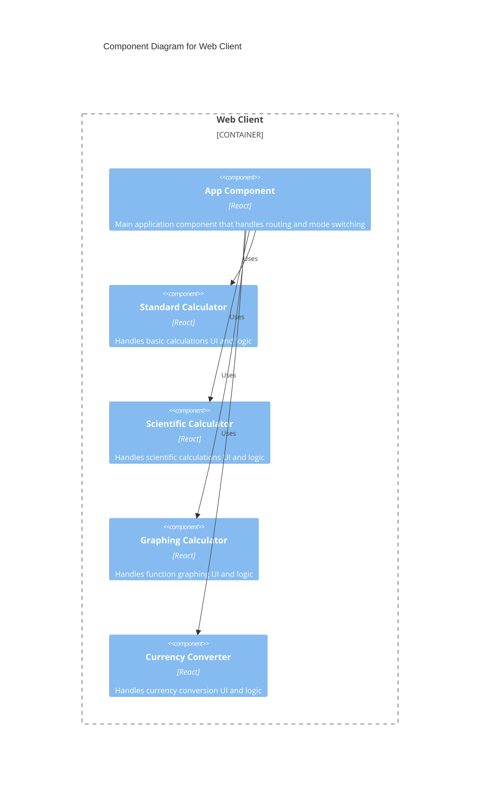

```mermaid
    C4Component
    title Component Diagram for Web Client

    Container_Boundary(webClient, "Web Client") {
        Component(app, "App Component", "React", "Main application component that handles routing and mode switching")
        Component(standardCalc, "Standard Calculator", "React", "Handles basic calculations UI and logic")
        Component(scientificCalc, "Scientific Calculator", "React", "Handles scientific calculations UI and logic")
        Component(graphingCalc, "Graphing Calculator", "React", "Handles function graphing UI and logic")
        Component(currencyConv, "Currency Converter", "React", "Handles currency conversion UI and logic")
    }

    Rel(app, scientificCalc, "Uses")
    Rel(app, standardCalc, "Uses")
    Rel(app, graphingCalc, "Uses")
    Rel(app, currencyConv, "Uses")
```