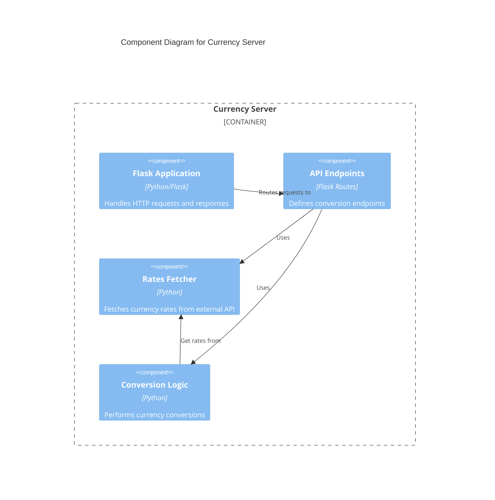

```mermaid
    C4Component
    title Component Diagram for Currency Server

    Container_Boundary(currencyServer, "Currency Server") {
        Component(flaskApp, "Flask Application", "Python/Flask", "Handles HTTP requests and responses")
        Component(apiEndpoints, "API Endpoints", "Flask Routes", "Defines conversion endpoints")
        Component(ratesFetcher, "Rates Fetcher", "Python", "Fetches currency rates from external API")
        Component(conversionLogic, "Conversion Logic", "Python", "Performs currency conversions")
    }

    Rel(apiEndpoints, ratesFetcher, "Uses")
    Rel(apiEndpoints, conversionLogic, "Uses")
    Rel(flaskApp, apiEndpoints, "Routes requests to")
    Rel(conversionLogic, ratesFetcher, "Get rates from")
```