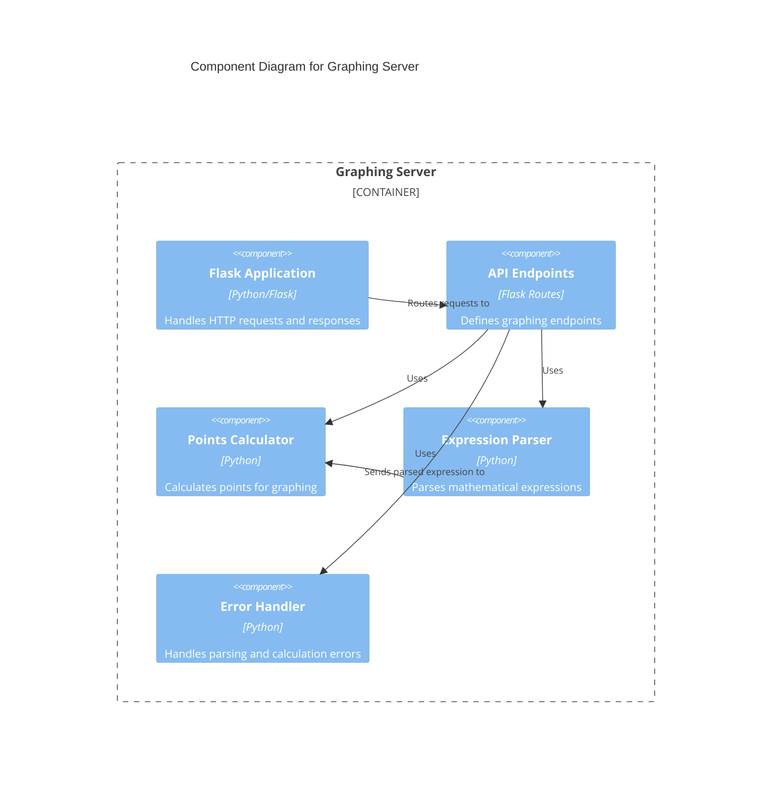

```mermaid
    C4Component
    title Component Diagram for Graphing Server

    Container_Boundary(graphingServer, "Graphing Server") {
        Component(flaskApp, "Flask Application", "Python/Flask", "Handles HTTP requests and responses")
        Component(apiEndpoints, "API Endpoints", "Flask Routes", "Defines graphing endpoints")
        Component(pointsCalculator, "Points Calculator", "Python", "Calculates points for graphing")
        Component(expressionParser, "Expression Parser", "Python", "Parses mathematical expressions")
        Component(errorHandler, "Error Handler", "Python", "Handles parsing and calculation errors")
    }

    Rel(apiEndpoints, expressionParser, "Uses")
    Rel(apiEndpoints, pointsCalculator, "Uses")
    Rel(apiEndpoints, errorHandler, "Uses")
    Rel(expressionParser, pointsCalculator, "Sends parsed expression to")
    Rel(flaskApp, apiEndpoints, "Routes requests to")
```