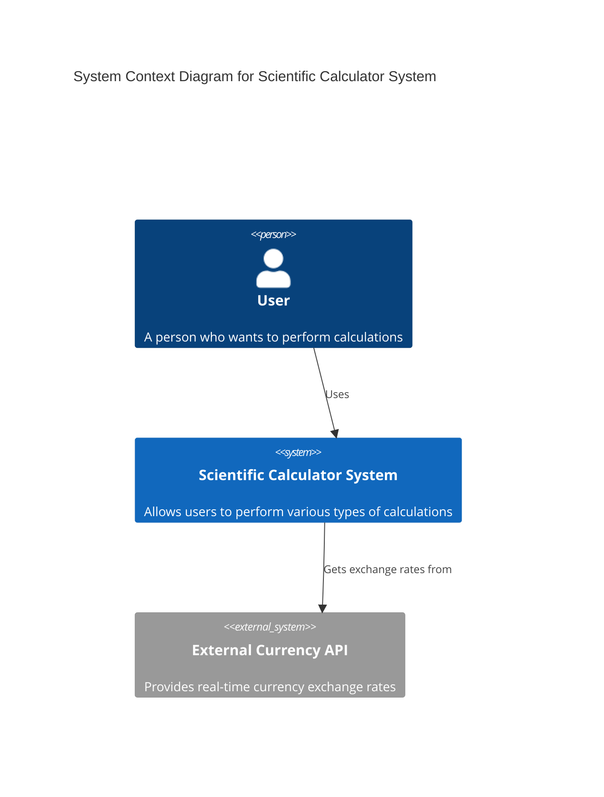

```mermaid
    C4Context
    title System Context Diagram for Scientific Calculator System

    Person(user, "User", "A person who wants to perform calculations")
    System(calculatorSystem, "Scientific Calculator System", "Allows users to perform various types of calculations")

    System_Ext(currencyAPI, "External Currency API", "Provides real-time currency exchange rates")

    Rel(user, calculatorSystem, "Uses")
    Rel(calculatorSystem, currencyAPI, "Gets exchange rates from")
```