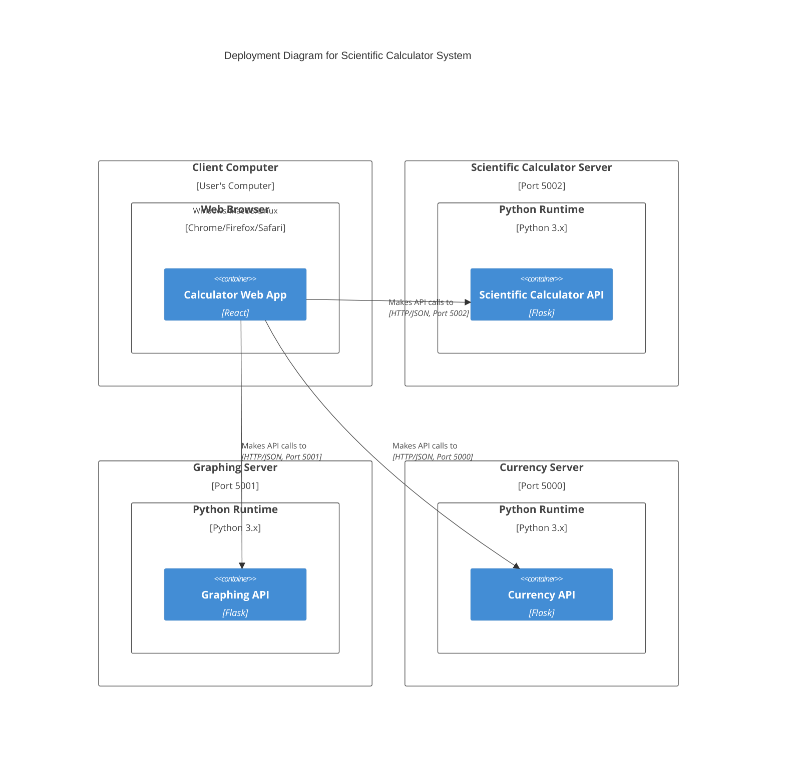

```mermaid
    C4Deployment
    title Deployment Diagram for Scientific Calculator System

    Deployment_Node(clientPC, "Client Computer", "User's Computer", "Windows/MacOS/Linux") {
        Node(browser, "Web Browser", "Chrome/Firefox/Safari") {
            Container(spa, "Calculator Web App", "React")
        }
    }

    Deployment_Node(scientificServer, "Scientific Calculator Server", "Port 5002") {
        Node(pythonRuntime1, "Python Runtime", "Python 3.x") {
            Container(scientificAPI, "Scientific Calculator API", "Flask")
        }
    }

    Deployment_Node(graphingServer, "Graphing Server", "Port 5001") {
        Node(pythonRuntime2, "Python Runtime", "Python 3.x") {
            Container(graphingAPI, "Graphing API", "Flask")
        }
    }

    Deployment_Node(currencyServer, "Currency Server", "Port 5000") {
        Node(pythonRuntime3, "Python Runtime", "Python 3.x") {
            Container(currencyAPI, "Currency API", "Flask")
        }
    }

    Rel(spa, scientificAPI, "Makes API calls to", "HTTP/JSON, Port 5002")
    Rel(spa, graphingAPI, "Makes API calls to", "HTTP/JSON, Port 5001")
    Rel(spa, currencyAPI, "Makes API calls to", "HTTP/JSON, Port 5000")
```