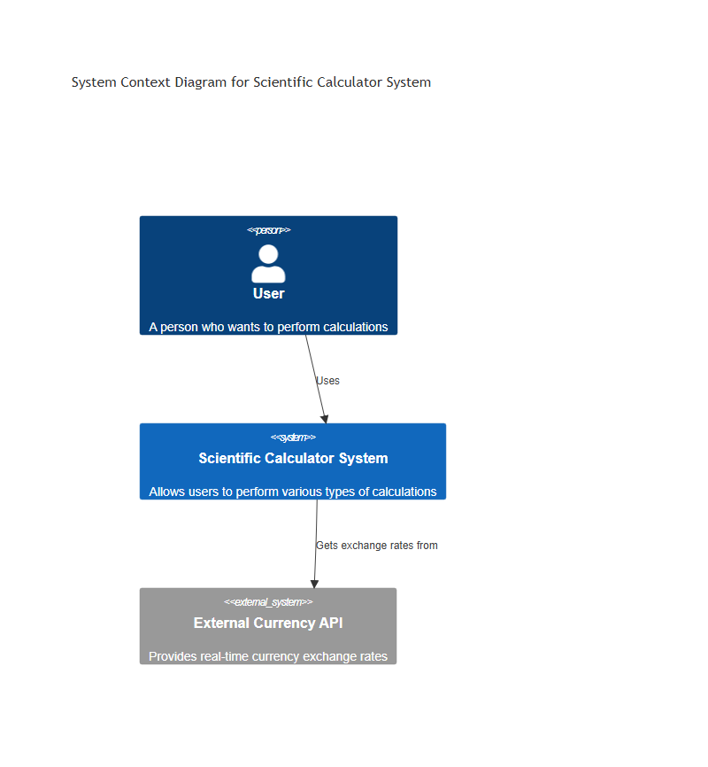
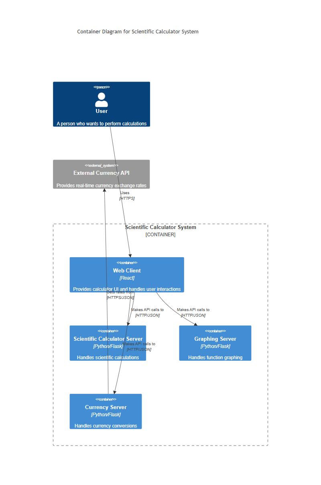
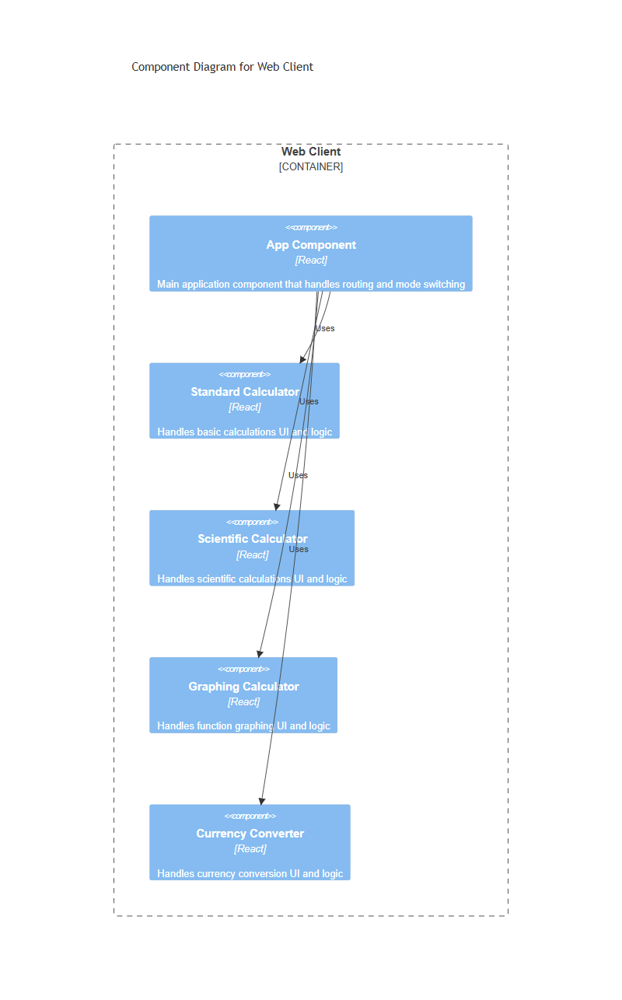
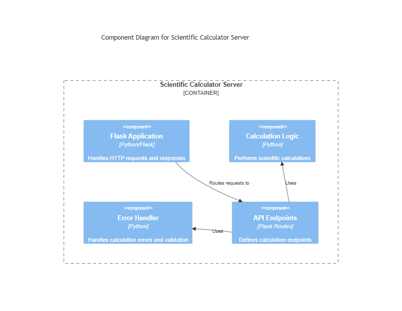
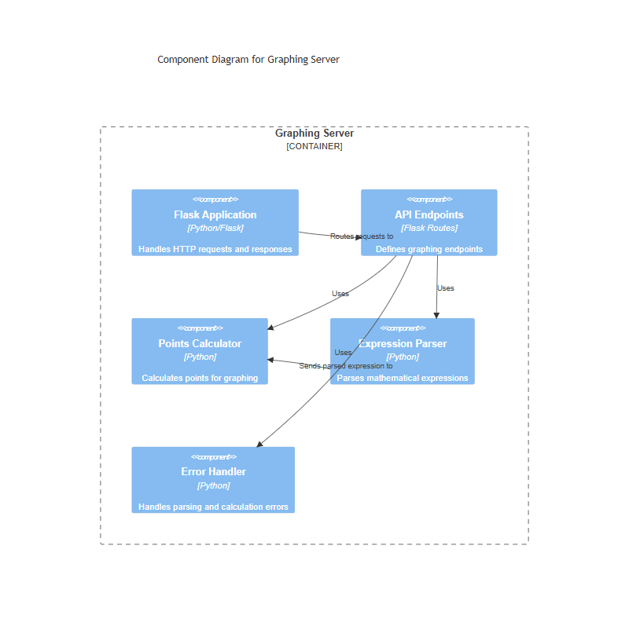
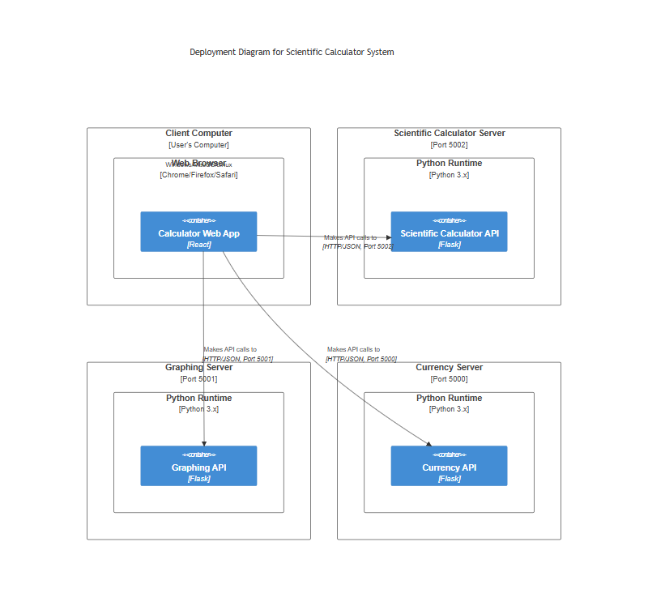

### System Context Diagram

The Scientific Calculator System operates as a comprehensive calculation platform that serves individual users requiring various types of calculations. At the system context level:

- **Users** interact directly with the calculator system to perform calculations ranging from basic arithmetic to complex scientific computations, graphing, and currency conversions.
- The system integrates with an **External Currency API** to provide real-time currency exchange rates, ensuring accurate currency conversions.
- This high-level view demonstrates the system's primary purpose: providing a versatile calculation platform while maintaining simplicity in its external interactions.

### Container Diagram

The Scientific Calculator System is structured into four main containers, each serving a specific purpose:

1. **Web Client (React)**
   - Provides the user interface for all calculator functionalities
   - Handles user interactions and input validation
   - Communicates with backend services via HTTP/JSON

2. **Scientific Calculator Server (Python/Flask)**
   - Processes complex scientific calculations
   - Provides mathematical function evaluation
   - Ensures accurate computation of scientific operations

3. **Graphing Server (Python/Flask)**
   - Handles function plotting and visualization
   - Processes mathematical expressions for graphing
   - Returns coordinate data for visual representation

4. **Currency Server (Python/Flask)**
   - Manages currency conversion operations
   - Interfaces with external currency API
   - Provides up-to-date exchange rate calculations

This containerization approach ensures:
- Clear separation of concerns
- Independent scaling and maintenance
- Modular system architecture

### Component assets

#### Web Client Components

The React-based web client is composed of several key components:
- **App Component**: Central routing and mode management
- **Scientific Calculator**: Handles complex mathematical operations
- **Standard Calculator**: Manages basic arithmetic calculations
- **Graphing Calculator**: Provides function visualization interface
- **Currency Converter**: Manages currency conversion interface

#### Scientific Calculator Server Components

The scientific calculation service consists of:
- **Flask Application**: HTTP request handler
- **API Endpoints**: Defines available calculation operations
- **Calculation Logic**: Core mathematical computation engine
- **Error Handler**: Manages calculation errors and validation

#### Currency Server Components

The currency service is structured with:
- **Flask Application**: HTTP request handler
- **API Endpoints**: Currency operation interfaces
- **Rates Fetcher**: External API communication
- **Conversion Logic**: Currency conversion engine

#### Graphing Server Components

The graphing service includes:
- **Flask Application**: HTTP request handler
- **API Endpoints**: Graphing operation interfaces
- **Expression Parser**: Mathematical expression processing
- **Points Calculator**: Coordinate generation
- **Error Handler**: Expression validation and error management

### Deployment Diagram

The calculator system employs a microservices architecture with separate deployment for each service:

1. **Client Deployment**
   - Runs in user's web browser
   - React-based SPA providing unified interface
   - Communicates with all services via HTTP/JSON

2. **Scientific Calculator Server (Port 5002)**
   - Independent Python environment
   - Flask-based API service
   - Handles scientific calculations independently

3. **Graphing Server (Port 5003)**
   - Independent Python environment
   - Specialized for function plotting
   - Isolated graphing computation service

4. **Currency Server (Port 5001)**
   - Independent Python environment
   - Manages currency operations
   - Responsible for crawling exchange rate 

Benefits of this deployment strategy:
- Independent scaling and maintenance
- Isolated service updates
- Clear network boundaries
- Flexible resource allocation
- Enhanced fault isolation