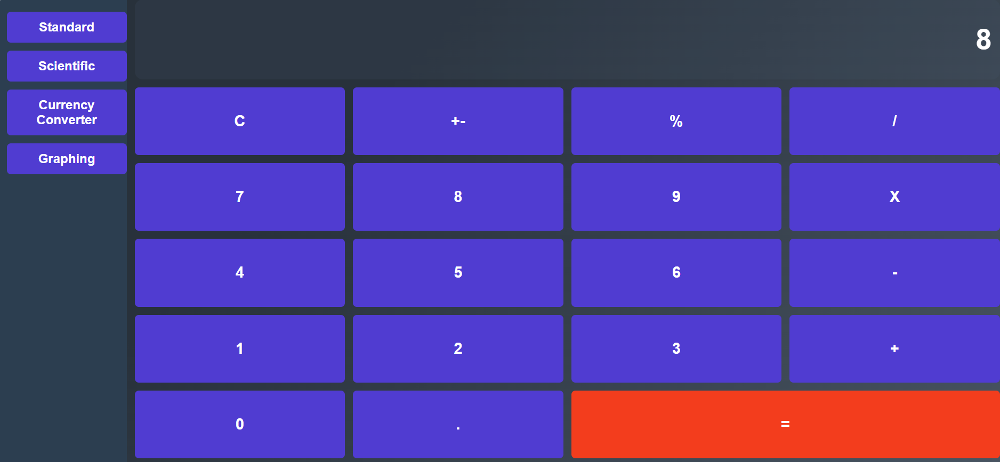
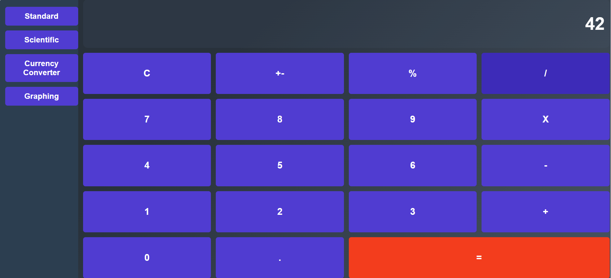
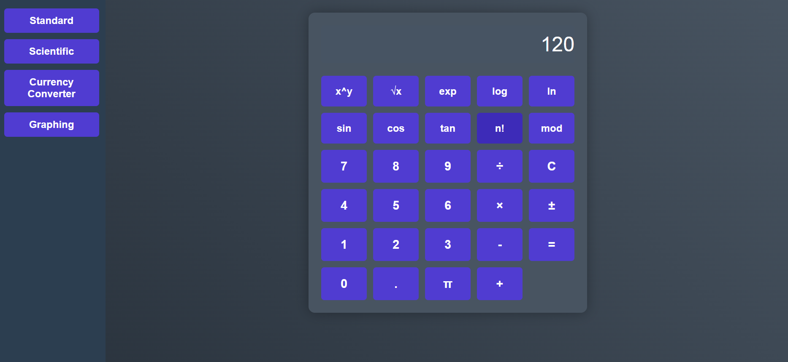
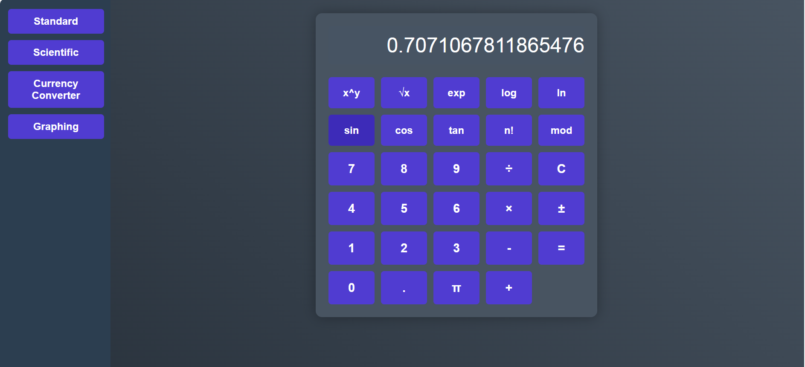
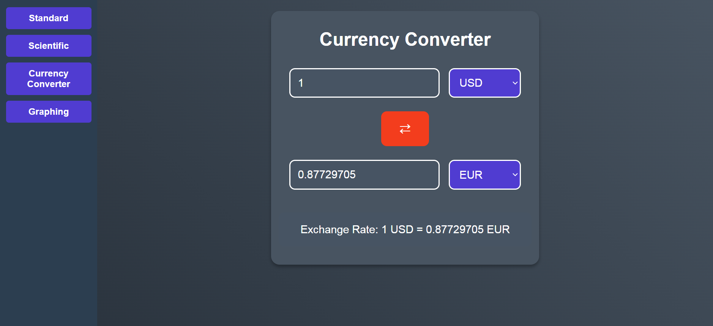
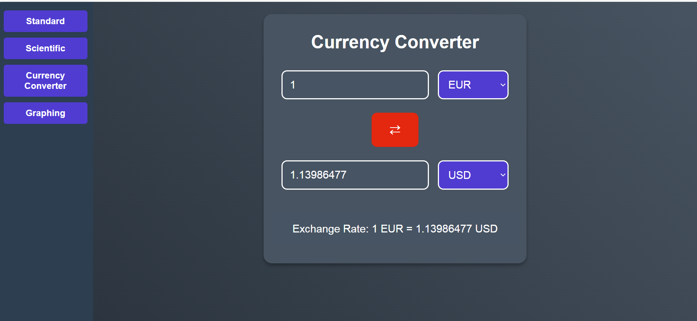
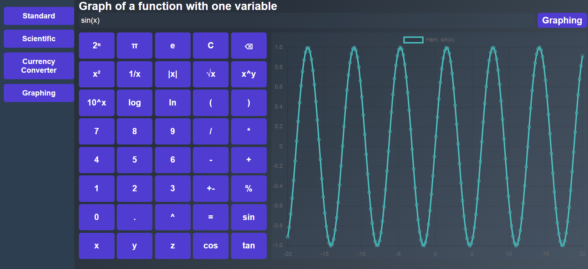
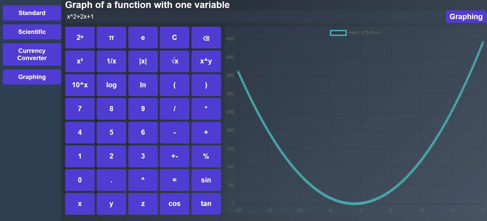

# Deployment Guide for Calculator Application

## Part 1: Run the Python Backend with `virtualenv` (one virtual environment per service)

The project includes separate services, for example, the graphing service: `server/graphing`.

### Step 1: Create a Virtual Environment for Each Service

#### 1. Navigate to the service directory

```bash
cd server/graphing
```

#### 2. Create a virtual environment using `virtualenv`

```bash
virtualenv venv
```

> This command creates a `venv/` directory in the current folder.

#### 3. Activate the virtual environment

* **On Windows**:

  ```bash
  venv\Scripts\activate
  ```

* **On macOS/Linux**:

  ```bash
  source venv/bin/activate
  ```

> After activation, you will see `(venv)` appear at the beginning of your terminal prompt.

#### 4. Install required libraries

* If there's a `requirements.txt` file:

```bash
pip install -r requirements.txt
```

#### 5. Repeat the above steps for other services under `server/`

Other services include `currency-converter` and `scientific-calculator`.

For Windows:

```bash
cd server/currency-converter
virtualenv venv
venv\Scripts\activate
```

```bash
cd server/scientific-calculator
virtualenv venv
venv\Scripts\activate
```

---

### Step 2: Run the Backend

The main file for each service is `app.py`:

```bash
cd server/name-of-service
```

```bash
python app.py
```

> 📡 By default, the server runs at `http://0.0.0.0:5001` or `http://127.0.0.1:5001`.

---

### Step 3: Deactivate the Virtual Environment

```bash
deactivate
```

---

## Part 2: Run the React Frontend (Node.js)

The frontend is located in the `client/calculator` directory.

### Step 1: Install Node.js (if not already installed)

* Download from: [https://nodejs.org](https://nodejs.org)

### Step 2: Install frontend dependencies

```bash
cd client/calculator
npm install
```

### Step 3: Run the React application

```bash
npm start
```

> The app will automatically open at `http://localhost:3000`

---

## Quick Command Summary Table

| Action                             | Example Command                   |
| ---------------------------------- | --------------------------------- |
| Create virtual environment         | `virtualenv venv`                 |
| Activate virtual env (Windows)     | `venv\Scripts\activate`           |
| Activate virtual env (macOS/Linux) | `source venv/bin/activate`        |
| Install Python dependencies        | `pip install -r requirements.txt` |
| Run backend                        | `python app.py`                   |
| Deactivate virtual environment     | `deactivate`                      |
| Install React frontend libraries   | `npm install`                     |
| Run React frontend                 | `npm start`                       |

---

# Testing Guide for Calculator Application

## Part 1: Standard Calculator Testing

### Basic Operations
Test the standard arithmetic operations:
- Addition: 5 + 3 = 8

- Multiplication: 6 × 7 = 42


## Part 2: Scientific Calculator Testing

### Mathematical Functions
Test advanced operations:
- Factorial: 5! = 120

- Trigonometric: sin(./test-with-screenshots/assets/45°) = 0.707


## Part 3: Currency Converter Testing

### Basic Conversion
Test currency conversion:
- USD to EUR conversion

- Use swap currency button


## Part 4: Graphing Calculator Testing

### Function Plotting
Test various functions:
- Trigonometric: sin(./test-with-screenshots/assets/x)

- Complex: x^2 + 2x + 1
