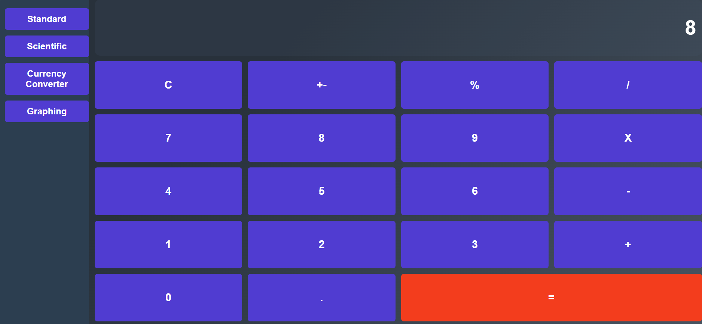
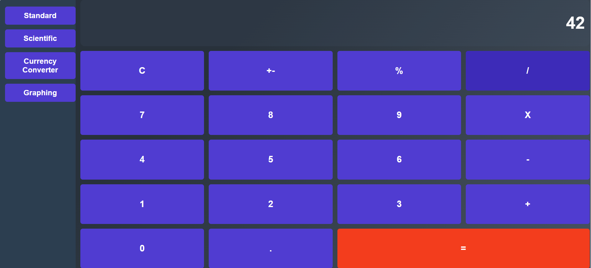
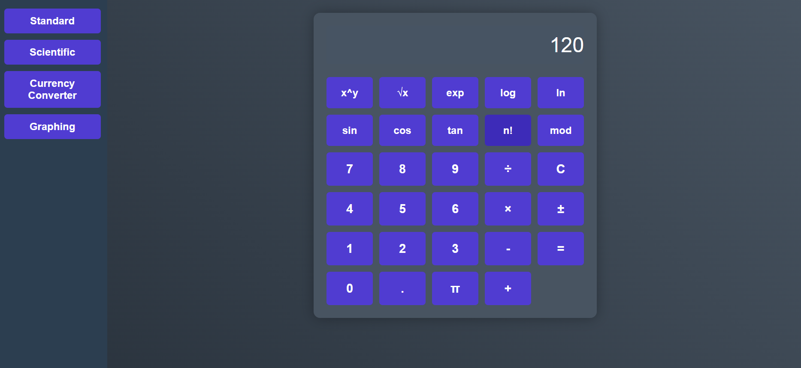
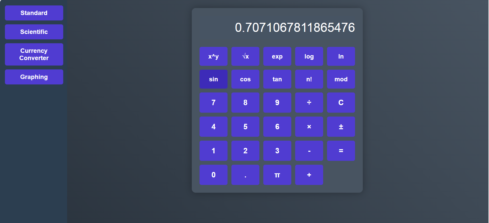
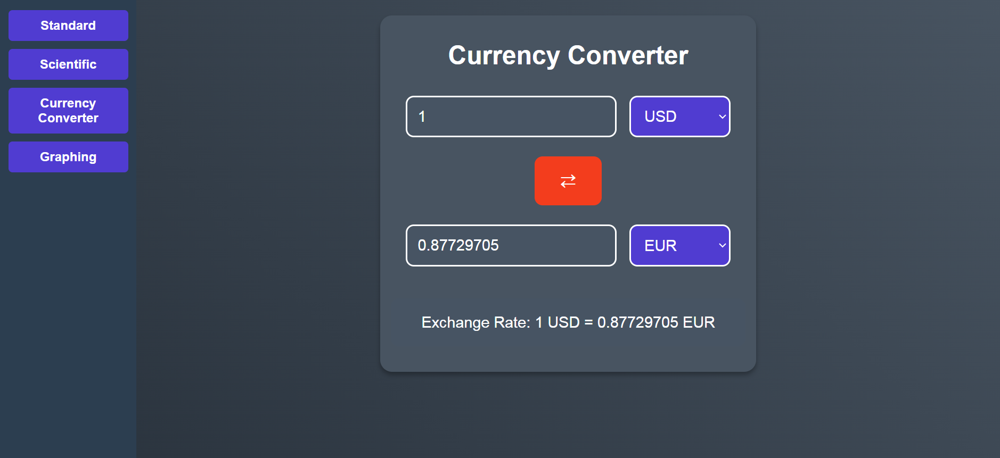
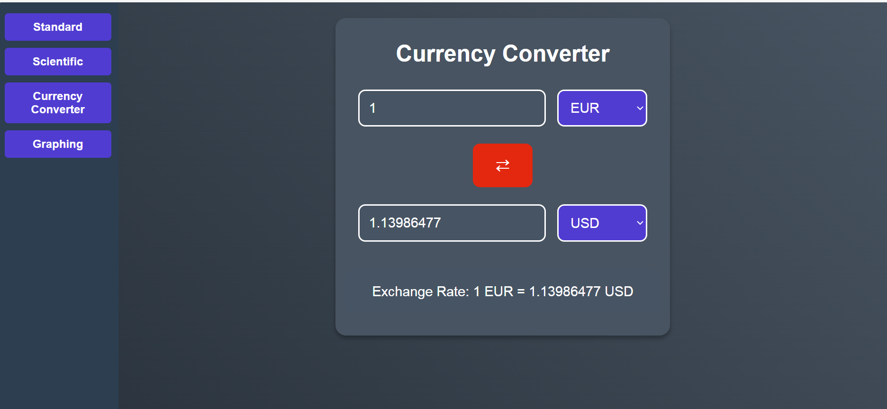
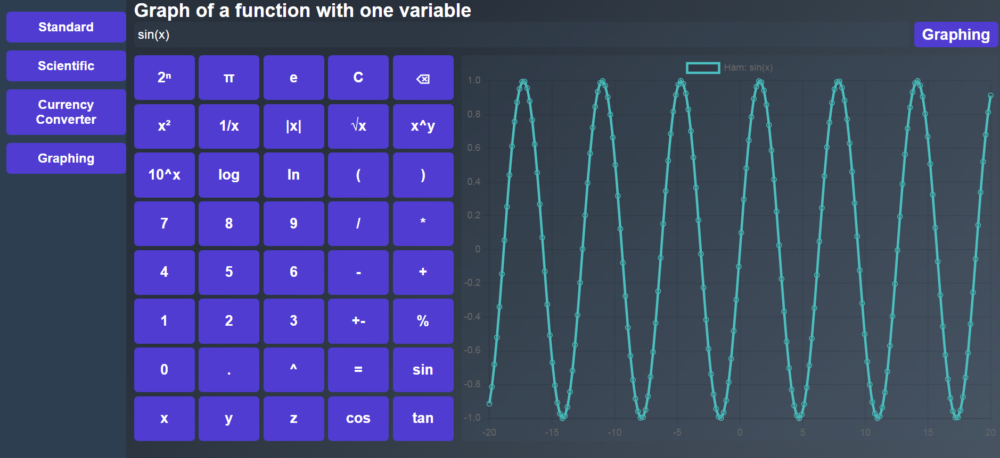

# Testing Guide for Calculator Application

## Part 1: Standard Calculator Testing

### Basic Operations
Test the standard arithmetic operations:
- Addition: 5 + 3 = 8

- Multiplication: 6 × 7 = 42

## Part 2: Scientific Calculator Testing

### Mathematical Functions
Test advanced operations:
- Factorial: 5! = 120

- Trigonometric: sin(45°) = 0.707

## Part 3: Currency Converter Testing

### Basic Conversion
Test currency conversion:
- USD to EUR conversion

- Use swap currency button

## Part 4: Graphing Calculator Testing

### Function Plotting
Test various functions:
- Trigonometric: sin(x)

- Complex: x^2 + 2x + 1

